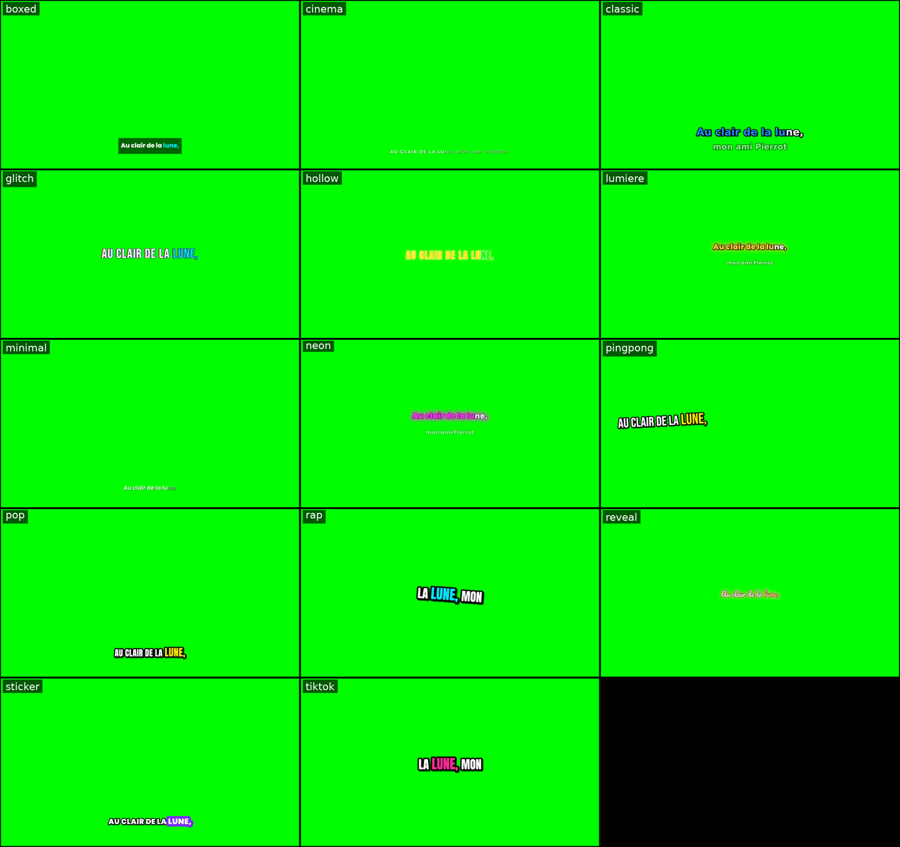

# lyricfx 🎤 : karaoké et lyrics stylés sur fond vert ou transparent

`lyricfx` crée automatiquement une vidéo de **paroles synchronisées mot à mot** (karaoké, surlignage, style TikTok…) à partir d'un **fichier audio**. Le résultat est prêt à incruster dans un clip :

- **fond vert** (`.mp4`), à détourer avec un chroma key ;
- **fond transparent** (`.mov` ProRes 4444 ou `.webm` VP9 avec canal alpha), à poser directement sur une piste dans Premiere, DaVinci Resolve, Final Cut, After Effects ou CapCut ;
- ou directement sur une image ou une vidéo de fond.

Tout est **paramétrable** (presets JSON, surcharges en ligne de commande) et **réutilisable** : un même style s'applique à autant de chansons que vous voulez, en lot.



---

## Comment ça marche

```
audio.mp3 ─┐
           ├─► [alignement forcé ou Whisper] ─► timing.json ─► (éditeur de calage) ─► .ass stylé ─► ffmpeg ─► vidéo
paroles ───┘      .txt / .lrc / LRCLIB
```

1. **Synchronisation automatique**, deux moteurs :
   - **Alignement forcé** (`--engine align`, utilisé d'office quand vous fournissez les paroles et que `stable-ts` est installé). Whisper ne cherche pas à *deviner* le texte : il repère **où chacun de vos mots est chanté**. C'est de loin le plus fiable sur du rap, du nouchi, du gospel avec beaucoup d'instruments. Avec Demucs installé, la voix est d'abord isolée de la musique.
   - **Transcription + rapprochement** (`--engine whisper`) : Whisper transcrit, puis vos paroles sont calées sur ce qu'il a entendu. C'est plus rapide, mais moins précis quand Whisper comprend mal.
2. **Timing JSON** : le résultat est enregistré dans un fichier JSON simple (un mot par ligne).
3. **Calage manuel (si besoin)** : l'**éditeur de calage** permet de corriger à l'oreille, en tapant le rythme (voir plus bas).
4. **Rendu** : un sous-titre `.ass` animé est généré (balayage karaoké, pop, glow, pastille, glitch…) puis ffmpeg/libass le rend en vidéo.

## Installation

Prérequis : **Python 3.10+** et **ffmpeg** (avec libass, présent dans la plupart des builds).

```bash
# ffmpeg : macOS → brew install ffmpeg · Ubuntu → sudo apt install ffmpeg · Windows → winget install ffmpeg
pip install -r requirements.txt       # faster-whisper, stable-ts (alignement forcé), demucs (isolation de la voix)
./fonts/download_fonts.sh             # (recommandé) polices libres utilisées par les presets
```

Au premier lancement, les modèles sont téléchargés automatiquement (quelques centaines de Mo à 1,5 Go selon le modèle).

## Démarrage rapide

```bash
# Tout-en-un : audio + paroles → vidéo fond vert, style néon
python -m lyricfx make ma-chanson.mp3 --lyrics ma-chanson.txt --language fr --preset neon

# Comparer tous les styles sur une seule image, à partir du timing obtenu
python -m lyricfx gallery out/ma-chanson.json

# Fond transparent (ProRes 4444 .mov), format vertical pour Reels/TikTok
python -m lyricfx make ma-chanson.mp3 --lyrics ma-chanson.txt --preset tiktok --bg transparent --size portrait

# Sans paroles : transcription 100 % automatique
python -m lyricfx make ma-chanson.mp3 --language fr --preset pop

# Paroles récupérées automatiquement sur lrclib.net (base libre de paroles synchronisées)
python -m lyricfx make ma-chanson.mp3 --lrclib "Artiste - Titre" --preset classic
```

Les fichiers sont écrits dans `out/` : `ma-chanson.json` (timing), `ma-chanson.ass` (sous-titres) et `ma-chanson.mp4` ou `.mov` (vidéo).

### Plusieurs chansons d'un coup

Placez les paroles à côté des audios, avec le même nom (`titre.lrc` ou `titre.txt`) :

```
album/
  01-intro.mp3   01-intro.txt
  02-single.mp3  02-single.lrc
  03-live.mp3                  ← pas de paroles : transcription automatique
```

```bash
python -m lyricfx make album/*.mp3 --preset neon --bg transparent --out-dir clips/
```

Si un timing existe déjà dans `out-dir`, il est **réutilisé**. Vous pouvez donc changer de style et relancer sans refaire la transcription (`--resync` force le recalcul).

### Workflow en deux temps (pour corriger le timing)

```bash
python -m lyricfx sync ma-chanson.mp3 --lyrics paroles.txt --language fr -o ma-chanson.json
# … vérifiez / corrigez (éditeur de calage ou à la main) …
python -m lyricfx render ma-chanson.json --audio ma-chanson.mp3 --preset pop --preview 42.5   # image PNG de test
python -m lyricfx render ma-chanson.json --audio ma-chanson.mp3 --preset pop                  # vidéo finale
```

`--preview SECONDES` rend une seule image PNG à l'instant voulu. C'est idéal pour régler un style en quelques secondes.

## Quand le texte n'est pas synchro

Du plus simple au plus précis :

1. **Tout le texte est en avance ou en retard du même écart** → `--offset` au rendu, sans recalcul :
   `python -m lyricfx render out/chanson.json --audio chanson.mp3 --offset -0.3` (négatif = plus tôt).
2. **Le calage dérive ou saute des lignes** → vérifiez que l'alignement forcé est actif (le terminal affiche « Alignement forcé des paroles »). Sinon : `pip install stable-ts demucs`, puis relancez avec `--resync`. Si ça ne suffit pas, passez à un modèle plus gros : `--model large-v3`.
3. **Chanson très difficile (voix superposées, ad-libs, accent fort)** → **éditeur de calage** :

   ```bash
   python -m lyricfx editor
   ```

   La page s'ouvre dans votre navigateur et fonctionne hors ligne ; vos fichiers ne quittent pas l'ordinateur. Chargez l'audio et les paroles, lancez la lecture (0,75× aide pour le rap), puis tapez **Espace** au début de chaque ligne. Corrigez ensuite en glissant les repères sur la forme d'onde ou avec les flèches ←/→. Exportez enfin :
   - **LRC** (recommandé) → `python -m lyricfx make chanson.mp3 --lyrics chanson.lrc --resync`. Vos débuts de ligne servent d'ancres, et l'alignement forcé cale chaque mot à l'intérieur.
   - **JSON** → `python -m lyricfx render chanson.json --audio chanson.mp3`. C'est votre calage tel quel ; le mode **Mots** permet de caler chaque mot à la main.

   L'éditeur peut aussi ouvrir un `.json` produit par lyricfx, pour ne retoucher que les lignes fausses.

## Formats de paroles acceptés

| Format | Exemple | Remarque |
|---|---|---|
| **Texte** `.txt` | `Au clair de la lune, mon ami Pierrot` | Une ligne = une ligne affichée. Les repères `[Refrain]`, `(Couplet 2)`, `(x2)` et les lignes vides sont ignorés. Nécessite Whisper. |
| **Chœurs / réponses** | `(C'est nous on coordonne)` | Une ligne entière entre parenthèses est affichée comme un **chœur** : plus petite, en italique, dans une autre couleur (réglage `echo`). |
| **LRC** `.lrc` | `[00:01.00]Au clair de la lune…` | Les temps de début de ligne servent d'ancres et fiabilisent l'alignement. Avec `--no-asr`, fonctionne même **sans Whisper** (mots répartis dans la ligne). |
| **LRC enrichi** | `[00:01.00]<00:01.00>Au <00:01.40>clair…` | Déjà synchronisé mot à mot : utilisé tel quel. |

Un exemple (chanson du domaine public) se trouve dans [`examples/`](examples/).

## Styles

```bash
python -m lyricfx presets
```

| Preset | Mode | Description |
|---|---|---|
| `neon` | karaoke | Balayage rose, halo lumineux qui s'allume sur les mots chantés, ligne suivante en aperçu |
| `lumiere` | karaoke | Gospel lumineux : remplissage or, halo chaud, chœurs en bleu ciel |
| `classic` | karaoke | Karaoké classique blanc → bleu, deux lignes |
| `hollow` | karaoke | Lettres en contour qui se remplissent de jaune |
| `cinema` | karaoke | Sous-titre discret, majuscules espacées |
| `minimal` | karaoke | Sobre, ombre douce |
| `pop` | highlight | Majuscules, mot chanté jaune qui « pop », contour épais |
| `sticker` | highlight | Style CapCut : mot chanté sur une pastille violette |
| `glitch` | highlight | Décalage rouge/cyan façon glitch |
| `pingpong` | highlight | Question / réponse : phrases alternées gauche / droite, couleur par phrase |
| `boxed` | highlight | Bandeau semi-transparent, lisible sur tout fond |
| `tiktok` | word | 3 mots max, énormes, au centre (Reels / TikTok / Shorts) |
| `rap` | word | 3 mots énormes, texte penché qui alterne, couleur différente à chaque phrase |
| `reveal` | reveal | Les mots apparaissent au fil du chant, halo doré |

Pour choisir, `python -m lyricfx gallery out/chanson.json` rend **tous les styles sur une seule image**, au même instant de votre chanson (`--at 42` pour choisir l'instant, `--size portrait` pour le vertical).

**Modes d'animation** :
- `karaoke` : la ligne se remplit progressivement, syllabe par syllabe ;
- `highlight` : le mot chanté change de couleur et grossit ;
- `reveal` : les mots apparaissent au moment où ils sont chantés ;
- `word` : quelques mots à la fois, en gros.

### Personnaliser

Surcharge ponctuelle :

```bash
python -m lyricfx render chanson.json --preset pop --set color_active=#FF3366 --set font_size=110 --set position=center
```

Ou créez votre propre style (réutilisable) en JSON. Seules les clés modifiées sont nécessaires :

```json
{
  "description": "Mon style de chaîne",
  "mode": "highlight",
  "font": "Bebas Neue",
  "font_size": 120,
  "uppercase": true,
  "color_active": "#FF3366",
  "glow": {"enabled": true, "color": "#FF3366", "when": "sung"},
  "position": "center",
  "animation": {"in": "pop", "out": "fade", "duration": 0.15}
}
```

```bash
python -m lyricfx make *.mp3 --preset mon-style.json      # ou --preset pop --style mon-style.json
```

Pour le rendre disponible par son nom, déposez-le dans `lyricfx/presets/`.

<details>
<summary><b>Toutes les options de style</b></summary>

Les tailles sont en pixels pour une vidéo de référence en 1080p. Elles s'adaptent automatiquement à la résolution de sortie.

| Clé | Défaut | Rôle |
|---|---|---|
| `mode` | `karaoke` | `karaoke`, `highlight`, `reveal` ou `word` |
| `font`, `font_size`, `bold`, `italic` | DejaVu Sans, 80 | Police (nom de famille) |
| `uppercase`, `letter_spacing` | false, 0 | Majuscules, espacement des lettres |
| `color_unsung`, `color_sung`, `color_active` | blanc, bleu, jaune | Couleurs avant chant, après chant, et du mot en cours |
| `unsung_opacity` | 1.0 | Opacité du texte pas encore chanté |
| `outline`, `outline_color` | 4, noir | Contour |
| `shadow`, `shadow_color`, `shadow_opacity` | 0 | Ombre portée |
| `blur` | 0.6 | Adoucissement des bords |
| `glow.enabled/color/size/blur/opacity` | off | Halo lumineux |
| `glow.when` | `always` | `always` ou `sung` (le halo s'allume mot par mot) |
| `box.enabled/color/opacity/padding` | off | Bandeau derrière le texte |
| `position`, `margin_v` | bottom, 110 | `bottom`, `center` ou `top` |
| `align`, `margin_h` | center, 90 | `center`, `left`, `right` ou `alternate` (une ligne à gauche, la suivante à droite) |
| `tilt`, `tilt_alternate` | 0, false | Inclinaison en degrés, éventuellement alternée |
| `palette` | `[]` | Couleurs d'accent qui changent à chaque ligne, ex. `["#FFE600", "#00E5FF"]` |
| `echo.scale/italic/color` | 0.8, true, rose | Style des chœurs (lignes entre parenthèses) |
| `active_box.enabled/color/size/text_color` | off | Pastille colorée derrière le mot chanté (`"color": "active"` = couleur active) |
| `rgb_split.enabled/offset/opacity/colors` | off | Décalage RVB façon glitch |
| `max_chars_per_line` | 32 | Les lignes plus longues sont coupées proprement |
| `lines_on_screen` | 1 | 2 pour afficher la ligne suivante en aperçu |
| `next_line.scale/opacity/color` | 0.8, 0.55 | Style de la ligne suivante |
| `words_per_screen` | 3 | Nombre de mots en mode `word` |
| `lead_in`, `tail`, `hold_gap` | 0.45, 0.4, 1.2 | Apparition avant le 1er mot, maintien après le dernier, pause maximale sans effacer |
| `animation.in` | fade | `fade`, `slide`, `zoom`, `pop` ou `none` |
| `animation.out`, `animation.duration` | fade, 0.18 | Sortie (`fade` ou `none`) et durée en secondes |
| `active_scale`, `pop_duration` | 1.15, 0.1 | Grossissement du mot actif |

</details>

## Options de rendu

| Option | Exemple | |
|---|---|---|
| `--bg` | `green`, `blue`, `#FF00FF`, `transparent`, `fond.jpg`, `boucle.mp4` | Fond de la vidéo |
| `--size` | `1920x1080`, `portrait`, `square`, `4k`, `720p` | Résolution |
| `--fps` | `30` | Images par seconde |
| `--offset` | `-0.3` | Décale tout le texte (secondes, négatif = plus tôt) |
| `--format` | `mp4`, `mov`, `webm` | Force le conteneur (sinon `.mp4`, ou `.mov` si transparent) |
| `--fonts-dir` | `./mes-polices` | Polices supplémentaires (le dossier `fonts/` est utilisé automatiquement) |
| `--ass-only` | | Génère seulement le `.ass`, à importer dans Aegisub, VLC ou un logiciel de montage |
| `--no-audio` | | Vidéo muette (sinon l'audio est inclus pour faciliter le calage au montage) |

Options de synchronisation : `--engine` (`auto`, `align`, `whisper`), `--model` (`tiny` → `large-v3`, plus gros = plus précis mais plus lent ; défaut `medium` en alignement), `--language fr`, `--vocals` / `--no-vocals` (Demucs), `--device cuda`.

## Conseils pour un rendu propre

- **Fond vert ou transparent ?** Préférez `--bg transparent` dès qu'il y a du **glow**, du **flou** ou de la **semi-transparence**. Un chroma key détoure mal ces pixels à moitié verts. Le fond vert convient aux styles à contour net (`pop`, `classic`, `tiktok`).
- **Évitez le vert dans vos couleurs** avec `--bg green`, sinon il sera détouré. Utilisez `--bg blue` ou `--bg magenta` si votre style est vert.
- **Précision** : fournissez toujours les paroles (alignement forcé) et installez Demucs. Pour une musique chargée, `--model large-v3` améliore encore le calage.
- Les timings restent **modifiables** dans le JSON. Relancez ensuite `render` : c'est instantané, sans nouvelle transcription.

## Structure du projet

```
lyricfx/
  cli.py        commandes sync / render / make / gallery / editor / presets
  asr.py        alignement forcé (stable-ts), Whisper (faster-whisper / openai-whisper), Demucs
  lyrics.py     lecture TXT / LRC / LRC enrichi, API LRCLIB
  align.py      alignement paroles ↔ mots reconnus, interpolation
  ass.py        génération des sous-titres animés (karaoké, pop, glow, bandeau…)
  render.py     rendu ffmpeg (vert, couleur, transparent, image/vidéo de fond)
  styles.py     valeurs par défaut, presets, surcharges
  presets/      14 styles prêts à l'emploi (JSON)
  editor/       éditeur de calage manuel (page web hors ligne)
fonts/          download_fonts.sh (polices libres OFL)
examples/       paroles d'exemple (domaine public)
```

> ⚖️ Pour les paroles de chansons protégées, assurez-vous d'avoir les droits nécessaires avant de publier la vidéo.
